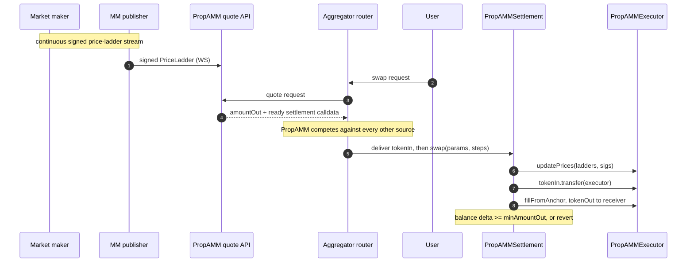

# Biconomy x Arbitrum: Increasing PropAMM volumes on Arbitrum

Biconomy PropAMM: infrastructure for running proprietary AMMs on Arbitrum. The stack is chain-agnostic EVM, deployed and verified on another L2 today, ready to deploy on Arbitrum One.

---

## The Opportunity for Arbitrum

Proprietary AMMs deliver tighter spreads and better prices than passive AMMs because market makers can actively manage adverse selection rather than absorbing it. On Solana, propAMM volume has grown to tens of billions of dollars per month, and propAMMs have at points handled the majority of SOL-stablecoin DEX flow. The category has proven itself where the infrastructure conditions allow it to work.

On EVM L2s the category has not broken through. On Base, where propAMMs began going live in November 2025, the category's share of DEX volume has stayed in the low single digits. During volatile markets, when price freshness matters most and propAMM advantages should be strongest, that share has spiked as high as 22% in a day, then collapsed back. The category is structurally capped, not because of weak products, but because of a missing infrastructure primitive.

Arbitrum is the chain best positioned to remove that cap. It secures more value than any other L2, has a professional-trading ecosystem that grew up around perps and active market making, and runs a sequencer stack that already treats ordering policy as something that can evolve. The missing piece is the contract-level settlement standard, which is what we bring.

---

## Why propAMMs on permissionless L2s are stuck

### Toxic Flow Problem

In a propAMM, the market maker signs prices off-chain. Those prices commit to the on-chain anchor when a swap settles. Between off-chain market moves and the next on-chain anchor refresh, the on-chain price is stale relative to live markets.

Latency-advantaged bots exploit this gap. The bot maintains a feed from a centralised exchange and a low-latency connection to the sequencer. When the off-chain market moves, the bot fires a swap against the stale anchor with an inline slippage check. If the swap lands before the MM's next price update, the bot fills at the stale price and closes off-chain at the new price. If it lands after, the check reverts and the bot just pays gas. The expected value is positive whenever the off-chain move is larger than the MM's spread within the staleness window.

Widening spreads does not solve it. The bot just fires on bigger moves, and the MM gets priced out of organic flow at wider spreads. The end state is toxic-only flow at any spread tight enough to compete with passive AMMs.

We have direct confirmation from one institutional market maker who ran a permissionless propAMM on an L2:

- Every spread width they tried produced toxic-only flow.
- User-side gas penalties did not deter the bots. Per-pickoff value exceeded the gas they paid on reverts.
- Organic flow never appeared at competitive spread levels.

That market maker shut down the permissionless channel and restricted execution to a curated allowlist plus per-order RFQ. They have indicated they would return to a permissionless standard if toxic orders were eliminated at the infrastructure level.

---

## How Ethereum L1 solved it, and why Arbitrum is the right home

On L1, specialised block builders (Titan most prominently) order MM price updates at the top of every block they build. A bot's swap arriving before the MM's price update still lands after the update inside the block, so the bot fills against the refreshed price. The protection emerges from competing builders and only applies in their blocks; MMs pay for it indirectly through MEV-Boost.

We solved the same problem at the contract layer instead. Our stack is chain-agnostic by design: the settlement contract and quote infrastructure can deploy on any EVM. What makes **Arbitrum the right home** to operate it on:

- **Single-sequencer model with a private mempool.** No public-mempool front-running of MM updates. Arrival-order sequencing from a private mempool already removes one class of toxic flow that L1 has to solve with builder competition.
- **250ms block times.** Our contract enforces that fills settle against a price committed in the same block. On Arbitrum, "same block" means a 250ms freshness window, about 8x tighter than Base's 2s blocks and about 50x tighter than L1's 12s. The residual staleness a bot can exploit is structurally small before any ordering mechanism is added.
- **Ordering policy is a live surface.** The intra-block ordering race that remains after same-block enforcement is a sequencing-policy problem, and Arbitrum has already shown it can ship sequencing policy as a product. We would like to explore new ordering primitives aimed at price freshness together; on our side they attach as a submission-path change, not a contract change. Details in [`transaction-ordering.md`](./transaction-ordering.md).
- **Retail-viable economics.** A single-pair propAMM fill costs about 222k gas all-in, including the on-chain price commit. At current Arbitrum gas that is a cent or two of execution cost, against roughly $0.15 for the same 222k on L1 at 1 gwei. That makes per-fill propAMM economics work down to small ticket sizes.

The contract-level enforcement we ship (ERC-8211-predicate-based, developed in collaboration with the Ethereum Foundation) is the new primitive. Arbitrum is the right operational home for it.

---

## What's been built

### Architecture

Two contracts. `PropAMMSettlement` is the entrypoint any caller uses to execute a swap; `PropAMMExecutor` is the fill engine that holds MM price anchors and enforces freshness.

Settlement takes the swap parameters plus an arbitrary list of steps, dispatches the steps, and then enforces exactly one thing: **the receiver's `tokenOut` balance must grow by at least `minAmountOut`, or the whole call reverts**. It holds no user funds between transactions and carries no standing token approvals.

```solidity
PropAMMSettlement.swap(
    SwapParams {
        address tokenIn;       // address(0) = native ETH
        address tokenOut;
        uint256 amountIn;
        uint256 minAmountOut;  // enforced on the receiver's balance delta
        address receiver;
    },
    Step[] steps               // calldata that fulfils the swap
)
```

Both contracts are deployed with deterministic CREATE2 salts, so an Arbitrum deployment would land at the same addresses already in use elsewhere.

#### Components

- **`PropAMMSettlement`**: generic `Step[]` dispatcher. Zero standing approvals, holds nothing between calls, enforces the delivery floor, not upgradeable. Owner-managed whitelist for the one delegatecall target (the ERC-8211 module).
- **`PropAMMExecutor`**: streaming-MM module. `updatePrices(ladders, sigs)` commits MM-signed price ladders; `fillFromAnchor(...)` reads the freshest anchor, enforces same-block freshness, and dispatches an exact-amount approve / fill / revoke through the MM's provider contract. Both entrypoints are permissionless: anyone may commit a validly signed ladder.
- **MM provider** (~100 LoC each): each MM deploys their own. Two functions: `signer()` returns the ladder-signing address (EOA or EIP-1271); `executeSwap()` is gated by `msg.sender == approvedExecutor` and moves inventory. The MM's internal logic is unconstrained: curve pricing, counterparty filtering, per-pair caps, all live inside. **MMs keep custody of their own inventory throughout.** There is no protocol vault and no pooled float.

#### Composability via Step[]

The step-based dispatch is what unlocks the protocol's flexibility. Any combination works inside a single `swap`:

- **Pure streaming-MM**: commit ladders, hand `tokenIn` to the executor, `fillFromAnchor` to the receiver (the production default)
- **Multi-venue split**: divide the input across several MMs, or across an MM and an external venue, summing deliveries to the receiver
- **Pure external venue**: approve the venue, call it, revoke
- **Multihop**: route A to B via a pivot token, with each later hop's amount read at execution time rather than precomputed
- **ERC-8211 runtime values**: delegatecall the whitelisted ERC-8211 module to splice a live balance into a step's calldata, which is what makes multihop and exact fee splits safe when an earlier fill delivers slightly less than quoted

The caller builds the `Step[]`. Settlement dispatches it and checks the floor. There is no protocol-side allowlist of route shapes: the composability surface is the EVM itself.



#### How flow reaches the protocol

The caller of `swap` executes the trade themselves, inside their own transaction, and pays their own gas. That makes PropAMM a liquidity source that plugs into existing routers rather than a destination users have to be sent to: propAMM prices compete inside the aggregators Arbitrum users already use.

Two integration shapes, both live:

- **Firm quote.** The integrator requests a quote and receives an exact `amountOut` plus ready-to-execute settlement calldata. We simulate the route before returning it, so a quote that comes back is one that executes. Simplest to integrate.
- **Ladder streaming.** The integrator streams signed price ladders over WebSocket and computes output locally, building the settlement calldata themselves. No per-quote round trip, so it suits routers that price thousands of candidate routes per second.

Because the executor's entrypoints are permissionless, an integrator never depends on us to submit anything. If our quote service is unreachable, a streamed ladder is still executable by whoever holds it, for as long as its signature is valid.

#### Same-block freshness enforcement

The protocol enforces, on every fill, that the MM-signed price was committed in the same block as the swap. The check is at the contract level, not at the user level. We use ERC-8211 predicates developed in collaboration with the Ethereum Foundation to express this constraint.

This is how we enforce ordering: as a **standard of EVM execution**, where every node verifies it deterministically as part of the normal fill path, rather than as a custom block-builder application that depends on a specific builder being in the lead. There is no MEV-Boost dependency, no Titan-style builder market to maintain, no per-block competition to win. The constraint is part of the contract; it holds on every node, every block, every time. Any chain that runs the EVM can deploy this without bringing along a custom builder stack.

That property, ordering enforced by the EVM itself rather than by who built the block, is what closes the cross-block stale-anchor vector that has historically been the dominant toxic-flow path on permissionless L2 propAMMs. On Arbitrum's 250ms blocks it binds tighter than anywhere else we could deploy it.

Two further constraints ride along with it. Each ladder carries a monotonic nonce, so a stale or replayed commit is a silent no-op rather than a usable anchor. And the executor tracks how much of each committed ladder has already been consumed within the block, so a single price commit cannot be drained repeatedly by multiple fills at the same stale level.

### User and MM protection

Same-block freshness enforcement closes the cross-block stale-anchor vector, the dominant path that took down the institutional MM mentioned earlier. Both sides benefit: MMs are protected from prior-staleness pickoff; users cannot be silently settled against a multi-block-old anchor.

A residual remains: drift between consecutive MM signatures within a single block. On Arbitrum that window is 250ms to begin with, and a sequencer-level ordering primitive is the natural mechanism to take the remaining ordering race off the table; we have the contract-level check ready to compose with one. See [`transaction-ordering.md`](./transaction-ordering.md).

For the MM, the operational requirement is to keep publishing signed prices on active pairs. Everything downstream is the integrator's transaction.

### MM Commitments

The second largest on-chain market maker by volume has committed to deploy on this standard. The institutional MM who experienced toxic-only flow and shut down their permissionless channel has indicated they would move to this standard if toxic orders are eliminated at the infrastructure level.

### Validation status

The contracts are deployed and verified on another L2 today, with bootstrap liquidity routing real swaps through an MM provider backed by an on-chain order book.

The fill path (`updatePrices` plus `fillFromAnchor`, including same-block freshness enforcement and the per-block volume cap) was exercised across a 10,000-fill consolidated load test on a public L2 testnet with a 100% success rate, every fill verified on chain against settlement events and independently re-queried. Multi-venue splits, cross-venue routes, mixed PropAMM-plus-venue routes, and ERC-8211 runtime-value routes all settle end-to-end.

Measured gas for a single-pair fill, taken from the contract test suite:

| Component | Gas |
|---|---|
| Price-ladder commit (`updatePrices`) | 78,811 |
| Fill (`fillFromAnchor`) | 98,165 |
| Settlement envelope, balance checks, transfer, sweep, event | ~45,000 |
| **Total per swap** | **222,057** |

Gas per fill is an EVM measurement and carries over to Arbitrum. It was taken against test tokens, so real-token warmth and storage costs will move it somewhat, and Arbitrum's gas accounting folds L1 data costs into gas used rather than into the price. We would re-validate cost and latency figures on Arbitrum infrastructure as a first integration step.

---

## Benefits for market makers

**Off-chain participation, on-chain custody.** Market makers publish signed price ladders over a WebSocket connection. Payloads are signed off chain and consumed at fill time. Inventory never leaves the MM's own provider contract, so there is no protocol vault to trust and no float to post.

**Same-block freshness, contract-enforced.** Every fill must consume a price committed in the same block as the swap. The contract reverts otherwise. The MM-signed `expiresAt` adds a wall-time cap on top. Together these reduce the toxic-flow window from unbounded prior staleness to intra-block residual, and on Arbitrum that block is 250ms wide. The remaining ordering race inside the window is what a sequencer-level ordering primitive would close.

**Bounded per-block exposure.** The executor tracks consumption against each committed ladder, so the MM's worst case at any one committed price is the size they signed for, not unlimited repeated fills at that price.

**Replay safety.** Every signed payload carries a nonce. MM nonces are strictly monotonic per pair; price commits with a stale or duplicate nonce are silent no-ops on chain, so parallel publishers race safely.

**No obligation to fill.** The provider contract can revert any fill for any reason. Refusing costs the MM nothing and cannot be turned into a loss.

**Predictable cost.** ~222k gas per fill, paid by the taker as part of their own swap transaction, not by the MM.

### Trust model

| Party | Worst case if compromised | Cannot do |
|---|---|---|
| Taker / integrator | Waste their own gas on a reverting route | Spend funds they did not bring, drain settlement, consume more ladder depth than the MM signed for |
| Market maker | Refuse to fill, sign stale prices (caught by `expiresAt` and same-block freshness), under-deliver on a quote (reverts) | Drain taker funds |
| MM provider contract | Revert any fill | Reenter the settle path, manipulate the anchor mid-call, take more input than the step handed it |
| Quote service | Censor quotes, choose between two valid routes | Forge signatures, move funds, prevent a held ladder from being executed by someone else |
| Settlement contract owner | Pause settlement, transfer ownership, sweep tokens at rest (the contract holds none between swaps) | Upgrade the contract (not upgradeable), take funds from an in-flight swap |

Trust concentrates on the MM signing key. Every other component is signature-enforced, reentrancy-bounded, or has no privileged authority over funds.

---

## What it costs

### Who pays what

- **Taker**: pays the gas for their own swap transaction, exactly as they would routing to any other on-chain source. No ETH top-up step beyond what a normal swap needs, no protocol-imposed spread on top.
- **Price commit**: paid inside the same transaction as the fill, by whoever submits it. There is no separate commit transaction to fund and no standing cost to keep an anchor warm, because a ladder is only committed when it is about to be used.
- **Market maker**: publishes signed price ladders over WebSocket. Revenue is the spread embedded in their signed price. Pays no gas.

### The number

222k gas per single-pair fill. At current Arbitrum gas that is roughly a cent or two of execution cost. The comparison that matters for a taker is against the alternative route rather than against zero: a propAMM fill costs more gas than a single passive-AMM hop, and earns that back through a tighter spread. That trade works on Arbitrum and does not work on L1, where the same 222k costs roughly $0.15 at 1 gwei. We would publish Arbitrum-measured figures as part of the first integration milestone.

---

## What we'd like to explore

The settlement standard is built, deployed, and load-validated. Two market makers are committed or conditionally committed to deploy on it: one the second-largest on-chain MM by volume, the other with direct experience of the toxic-flow problem.

The contract-level enforcement we ship handles the cross-block stale-anchor case structurally. The intra-block residual is an ordering race, which is a sequencing-policy problem. We'd like to scope with the Arbitrum team what a new ordering primitive aimed at price freshness could look like, and how both sides benefit: tighter quotes and professional liquidity for the chain, a freshness guarantee for makers, a general primitive for anything ordering-sensitive. Joint design from here, joint launch, joint volume credit to Arbitrum.

---

## What the protocol does not do

The settlement contract does not price the trade. The MM provider returns `amountOut`; settlement only enforces `minAmountOut`. It does not filter counterparties (that lives in the provider contract). It does not bound fill sizes beyond the depth the MM signed for (provider contract). It does not hedge. It does not custody MM inventory. It does not arbitrate between MMs: the caller picks the route and settlement executes it rather than auctioning or reordering.

---

## Standards

- **EIP-712** typed-data signatures for every signed payload.
- **EIP-1271** signature verification: smart-account wallets and HSM-backed signing keys work with no protocol-level distinction from EOAs.
- **ERC-8211** composable-calldata module, developed in collaboration with the Ethereum Foundation, used both for anchor-freshness predicates and for splicing runtime values into a route. Every fill requires `block.number == anchor.commitBlock`, which removes the user-side tunability that would otherwise allow toxic flow through chosen-stale-anchor selection.
