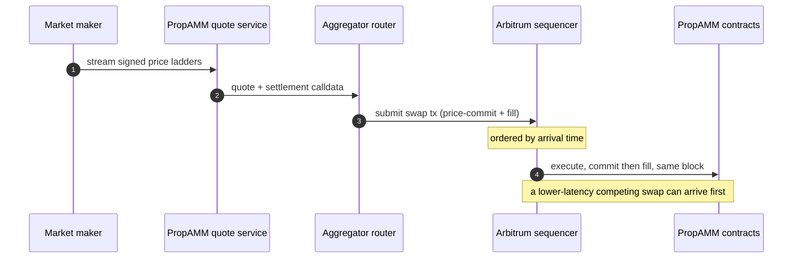
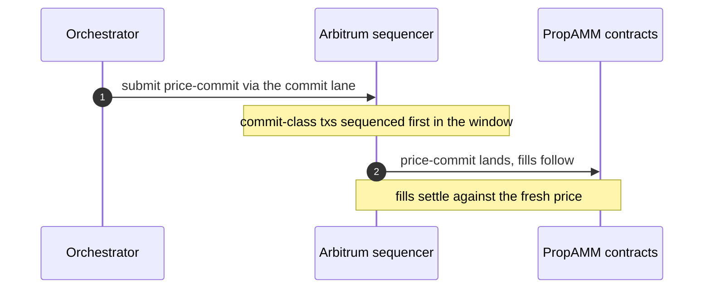
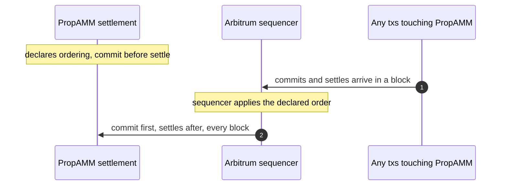

# PropAMM and transaction ordering on Arbitrum

This note maps how PropAMM would work with new transaction-ordering primitives on Arbitrum: where they would attach in our stack, two directions we see and how we would use each, why ordering is valuable for Arbitrum, and the questions that would help us plan.

## Background

PropAMM commits a market maker's freshly signed price on chain in the **same block** as the fill, and the contract rejects any price older than the current block. That closes the cross-block stale-price vector. On Arbitrum's 250ms blocks, this check alone bounds staleness to a very small window.

What remains is intra-block. Arbitrum sequences transactions in arrival order from a private mempool, so nothing guarantees our price-commit is ordered ahead of an adverse swap except winning a latency race, and that is the race CEX-feed bots are built to win. A mechanism that lets our commit land first takes the contest off raw latency. What then remains is only how far the market moves between our commit and the fill inside that window, which we shrink by committing more often.

Arbitrum has already shown that sequencing policy can be productized (Timeboost). This note is not about that mechanism; it is about what a primitive aimed specifically at price freshness could look like, and what we and Arbitrum would each get out of it.

The property we care about, stated independent of any mechanism:

> If our price-commit is ordered ahead of fills against our contract within a block or sub-block, then those fills settle against a price no older than that window's commit. Ordering the commit first closes the cross-block and ordering-race vectors. What is left is the price drift between commit and fill inside the window, which narrows as our cadence tightens, rather than an open-ended loss to whoever has the lowest latency to the sequencer.

## Where ordering would attach in our stack

PropAMM is two contracts and an off-chain quote service:

- **PropAMMSettlement** is the swap entrypoint (dispatches the route's steps, enforces the delivery floor).
- **PropAMMExecutor** holds the price-commit (`updatePrices`) and the fill (`fillFromAnchor`), and enforces same-block freshness (`commitBlock == block.number`). Both entrypoints are permissionless.

In production, whoever executes the swap submits one transaction containing both the price-commit and the fill, as consecutive steps of the same `swap` call. Commit and fill are already atomic inside that transaction. The place an ordering primitive helps is at the **block** level: making sure the commit lands ahead of anything else in the block that could consume the anchor.

Note that the submitter is typically an aggregator's router rather than us, since integrators execute their own routes. So the ordering question is not "can Biconomy get priority" but "can a price-commit be ordered ahead of fills against the same anchor, whoever submits it".



The `updatePrices` price-commit and the same-block freshness check are the two hooks any ordering mechanism would interact with. Both already exist and are running on our testnet deployment.

## Two directions for a new ordering primitive

### Direction 1: a commit lane, sequencing priority scoped to price commits

Designs in this category give a class of transactions earlier placement within a block or sub-block window. The version that serves price freshness best is deliberately narrow: a lane for **price-commit transactions**, not general-purpose priority. Contracts (or selectors) register for it, and transactions targeting them are sequenced at the front of their window.

How we would use it: the orchestrator submits its settle batches, or standalone price-commits, through the commit lane. Our freshly signed price lands ahead of competing fills in that window, and those fills settle against the price we just committed rather than a stale one.



On our side this is a submission-path change only, no contract change, so it is the direction we could adopt fastest. For Arbitrum, a narrowly scoped lane is easier to square with sequencer neutrality than general priority: it accelerates a class of transactions that makes prices fresher for everyone, and it is a surface Arbitrum can shape (registration policy, per-window allocation, pricing) however fits the chain's goals.

### Direction 2: application-declared ordering, a standing rule

Designs in this category let a contract express an ordering preference that the sequencer honors, for example "for transactions touching this contract, the price-commit is ordered before the settle." A standing rule rather than a per-window acquisition.

How we would use it: PropAMMSettlement expresses that its price-commit precedes its settle calls. Any block containing transactions to PropAMM would order the commit first, regardless of who submitted the fills. That also opens a cleaner architecture: price-commits as standalone transactions we publish every block, with fills submitted by integrators carrying no commit of their own, still settling against a same-block, first-ordered anchor. That would cut roughly 79k gas of commit cost out of every fill. The executor's entry points are already permissionless, so this needs no contract change on our side.



One illustrative way we might express this on our side, if such a primitive existed:

```solidity
interface ISequencingPolicy {
    // Selectors to order first, within a block, for txs to this contract.
    function orderingPolicy() external view returns (bytes4[] memory firstSelectors);
}
// PropAMMSettlement.orderingPolicy() returns [updatePrices.selector]
```

This is a larger change on the sequencer side and a bigger design question, so it is a longer-term direction rather than a near-term step. The two directions compose: a commit lane decides which transactions arrive first, a standing rule decides how they are arranged once they arrive.

## Why this matters for Arbitrum

Price ordering is not only useful to us. A few reasons we think it is worth Arbitrum's attention, some of which you likely already see:

- **Better prices for Arbitrum users.** Market makers that cannot be picked off on stale quotes can quote tighter. Tighter quotes mean better execution, which keeps more trading on Arbitrum.
- **Attracts professional liquidity.** Reliable intra-block ordering is something serious market makers expect. A chain that offers freshness guarantees at the sequencing layer is a natural home for on-chain market making.
- **A general primitive, not a one-off.** Anything that needs deterministic intra-block ordering benefits, including oracle updates, liquidations, and on-chain auctions. A commit lane or a declared-ordering rule is shared infrastructure, not a PropAMM feature.
- **A monetizable surface.** Ordering guarantees are something participants will pay for. How a new primitive is allocated and priced is Arbitrum's call; the demand side exists, and flows that protect maker inventory are recurring demand rather than one-off extraction.

## What we bring

Already in place on our side: the `updatePrices` price-commit, the same-block freshness check, and a submission path we can point at whatever the primitive turns out to be. The contracts are deployed on another L2 today, so we can prototype against an experimental design quickly, including on a dedicated test deployment if that is the easiest sandbox.

## Questions for Arbitrum

- Is sequencing priority scoped to a declared transaction class (price commits, oracle updates) something you would consider, and what form would fit your neutrality goals?
- Is application-declared ordering (a standing commit-before-settle rule) a direction you are exploring, and how do you weigh it against keeping the sequencer policy-free?
- What is the smallest ordering experiment we could run together soon, and where would you want it to live (testnet, a dedicated chain, a limited mainnet pilot)?

We will keep iterating as we scope the Arbitrum deployment, and we are happy to compare notes whenever useful.